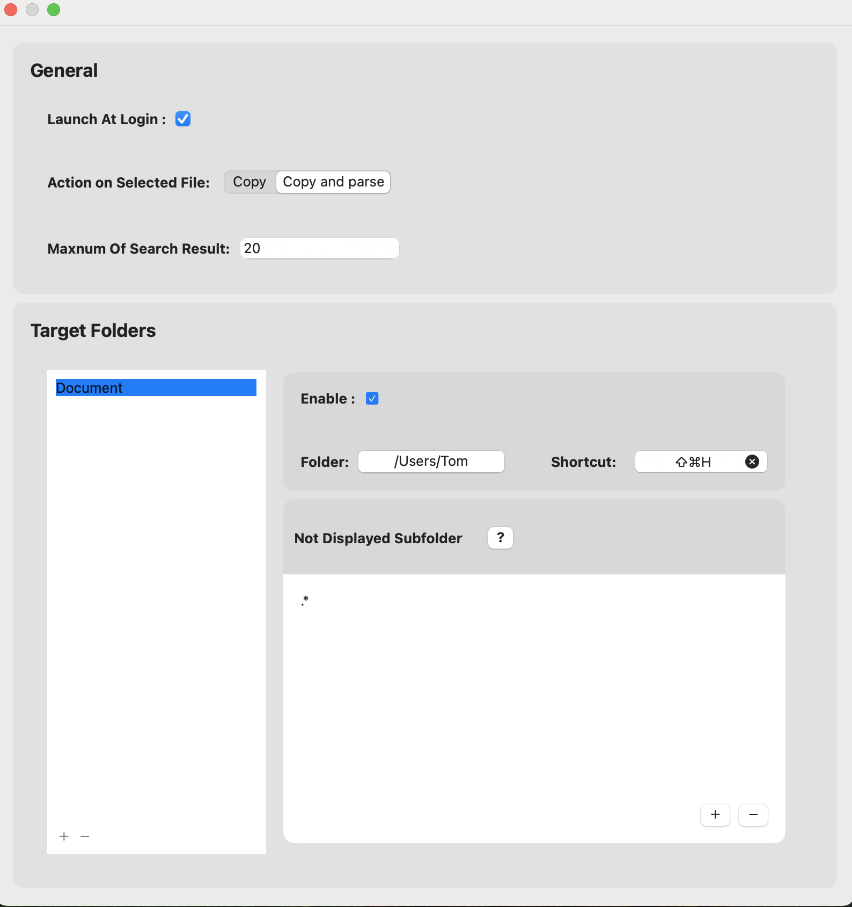
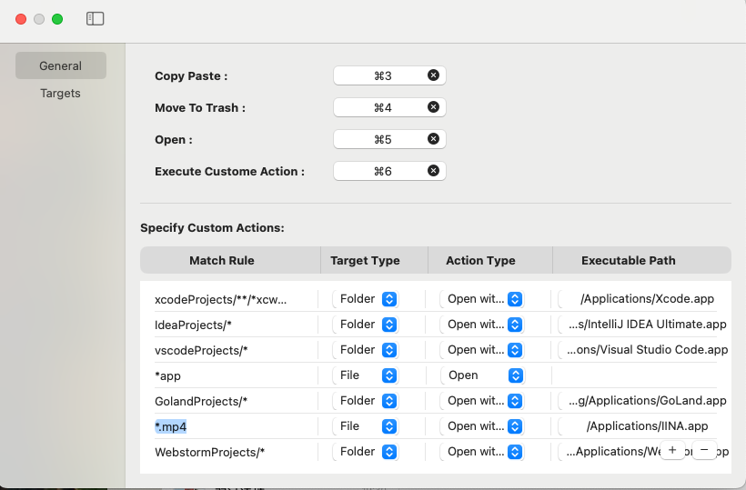
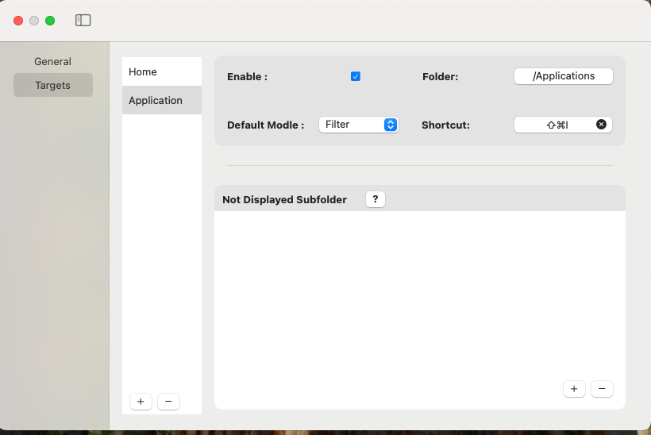
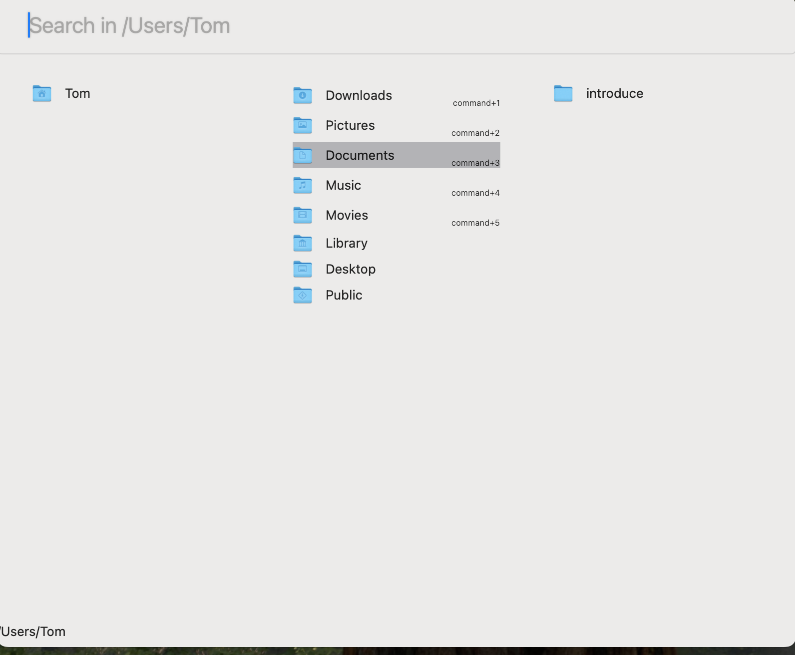
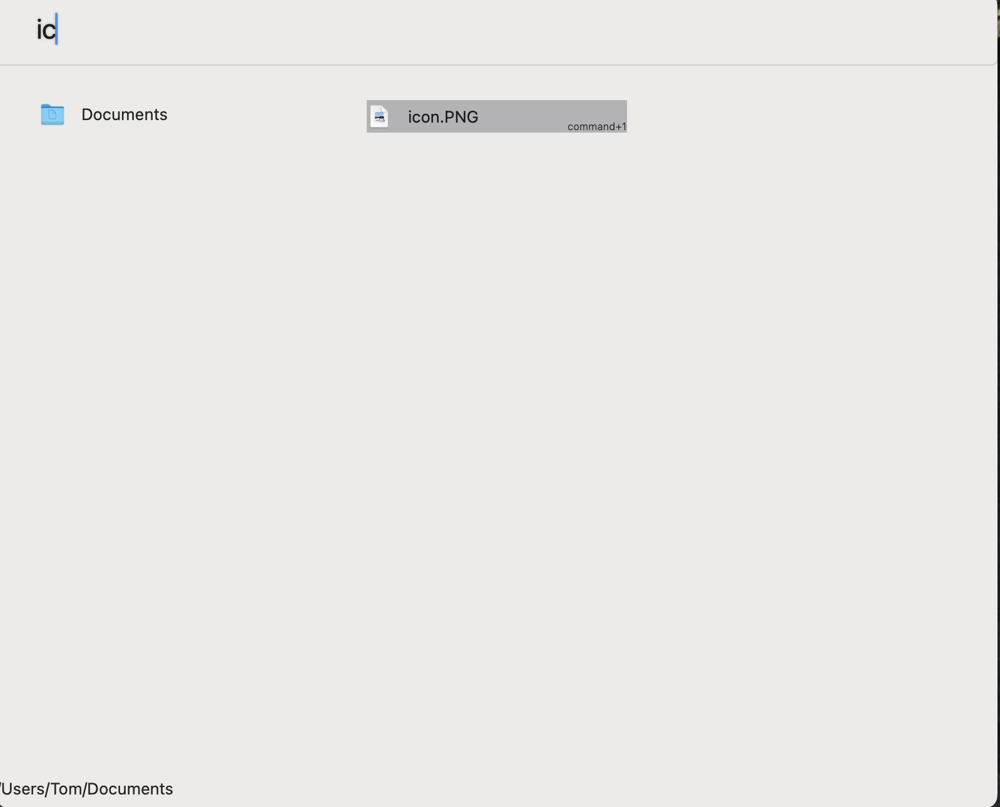
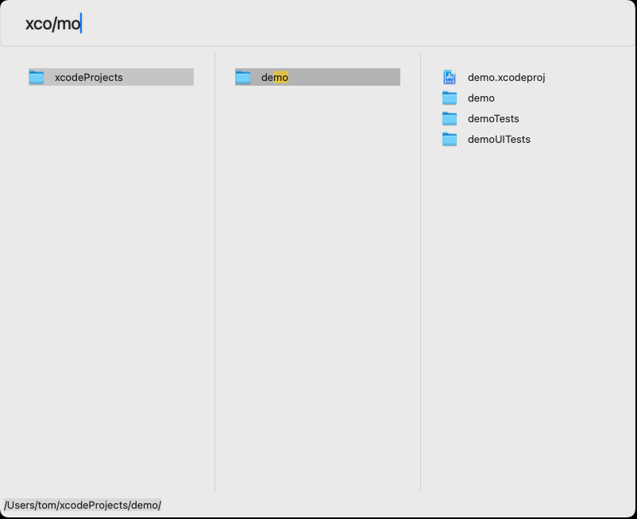

:toc:
:toc-placement: left
:toclevels: 4
:!last-update-label:
:nofooter:
= FinLighting Documentation

++++
<video width="800" height="400" controls>
  <source src="video/preview.m4v" type="video/mp4">
</video>
++++

== Introduction

`FinLighting` is a tool that allows you to open a file search window at anywhere. You can quickly locate file execute various actions such as copy, paste, open folder or file by application, etc (maybe requires enabling accessibility permissions).

`FinLighting` has many features:

. Binding a shortcut to a folder, and then activate file `browsing window` by the shortcut everywhere
. Type words to search files in `browsing window`
. Filter file in `browsing window`
. Specify custom actions on selected files or folders

==  Settings

You can open the settings window from the menu bar.
Settings contains two parts:

. General, some software also called `Global`, to set action settings
. Target, is to add folders and binding shortcuts to it.

=== General

General includes some basic configuration options:

. `Launch At Login` : Allow `FinLighting` active at login
. `Enable File Preview` : to preview file.

. `Maxnum Of Search Result` : The maximum number of displayed search results.

==== Action on Selected File

In this section, you can specify local shortcut for every action,

. `For Enter Key`: Specify action for Enter key
. `Copy`: Copy selected item to Clipboard
. `Copy Path`: Copy path of selected item to Clipboard
. `Copy Paste` : Copy and paste selected item to work space you are working on
. `Move To Trash`: Move selected item to trash
. `Open`: Open selected item

[[specify-custom-actions]]
==== Specify custom actions

`custom actions` enable you to execute different actions on various targets. Imagine you have a folder
named `frontendProjects` that contains many projects like `website-a`, `website-b`,
you like use `Visual Studio Code` to open and edit these projects,
you can specify the `Match Rule` is `frontendProjects/*`, `Target Type` is `Folder`, `Action Type` is `Open with app`,
and choose `Visual Studio Code` as `Executable Path`, once you press the shortcut you specified on `website-a` or `website-b`,
`Visual Studio Code` will open these folders

`FinLighting` supports various `Match Rule`

. `pass:[*.png]` means all png files
. `pass:[frontendProjects/*]` means subfolders or subfiles of frontendProjects
. `pass:[frontendProjects/**]` means all folders or files in frontendProjects
. `pass:[frontendProjects/**/*(.jpg|.png)]` means all jpg or png files in frontendProjects

You can add many rules, but `FinLighting` always execute actions for first-matched rule
A blank rule always be matched, `FinLighting` recommend you add blank rule to last as default action

=== Targets

Targets allows you to set up a shortcut key for a directory you want to binding,
so you can quickly open the `browsing window` by the shortcut.

====  Not Displayed Subfolder

Specify folders that will not be displayed in  `browsing window`

For example:

1. work/target hides the target folder under any parent directory named work.
2. *parentFolder*/target hides target folders under any parent folder whose name includes "parentFolder".
3. *target* hides folders with "target" in their name.
4. .* hides folders starting with a dot (that means hidden folders).

== Browsing window

=== Overview

Once you create a `Target Folder` and binding a shortcut to it, you can use the shortcut to open a `browsing window` everywhere.

`browsing window` has two main sections:

. Input Field: Type a file name directly to search, or type text starting with "/" to quickly filter files or folders.
. File List: The first column shows the parent folder, the second column shows the current folder, and the third column displays subfolders.

`browsing window` supports two model as well.

. search model: you can type words to search files or folders in the folder you are in
. filter model: you can type path like `down/img/` to filter or enter folders, deleting words means exit folders

You can switch these modes by `Tab` keyboard.

Except for these models, you can always use Up-Arrow, Down-Arrow, Right-Arrow, and Left-Arrow keys to select a folder or file

=== Search model

To search a file, you can simply type the name of the file you're looking for in the Input Field.

=== Filter model

You can type a string in the `Input Field` to filter folders or files. once you input one `/`,
you will enter the folder you selected

Like the image above, we have a file whose path is xcodeProjects/demo, you can type `/xco/demo` to locate the file, and yes you don't need to type the entire path name or file name

If you add rule to `Match Rule`: `pass:[xcodeProjects/**/*.xcodeproj]`, and specify the action
to `open with xcode`
in  <<specify-custom-actions,Specify custom actions>>
, you can immediately open the folder with xcode

== Get FinLighting

[link=https://apps.apple.com/us/app/finlighting/id6737697840?l=zh-Hans-CN&mt=12]
image::images/app-store-badge.svg[]

== Contact
If you have any suggestions or questions, please contact me at lightsofts@hotmail.com.