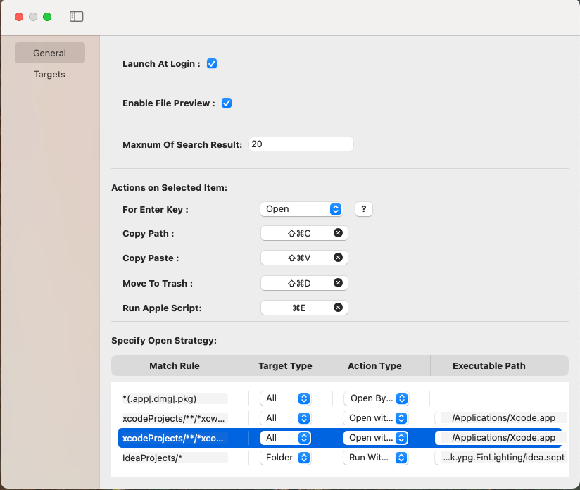

:toc:
:toc-placement: left
:!last-update-label:
:nofooter:
= FinLighting Documentation

== Introduction

`FinLighting` is an assistant tool that allows you to open a file search window at anytime, anywhere. You can quickly locate file and copy it to your current workspace (which requires enabling accessibility permissions).

`FinLighting` provides multiple ways to locate files:

1. Use Up-Arrow, Down-Arrow, Right-Arrow, Left-Arrow keys to navigate through files and folders.
2. Directly search for files in the text box.
3. Type a string starting with "/" in the text box to filter files or folders.

==  Settings
You can open the settings window from the menu bar.

=== General Settings

General includes some basic configuration options:

. `Launch At Login` : Allow `FinLighting` active at login
. `Action on Selected File` : Choose the action triggered by pressing Enter Key or the shortcut (Command + 1) on a selected file.

. Copy: Copy selected file to Clipboard
. Copy and parse: Copy selected file and parse it to your workspace. This operation requires enabling accessibility permissions

. Maxnum Of Search Result: The maximum number of displayed search results.

=== Target Folders

Target Folders allows you to set up a shortcut key for a directory you want to binding, so you can quickly open the search window by the shortcut.

===  Not Displayed Subfolder

Specify folders that will not be displayed in Search Window

For example:

1. work/target hides the target folder under any parent directory named work.
2. *parentFolder*/target hides target folders under any parent folder whose name includes "parentFolder".
3. *target* hides folders with "target" in their name.
4. .* hides folders starting with a dot (that means hidden folders).

== Using the Search Window

=== Overview

Once you create a `Target Folder` and binding a shortcu to it, you can use the shortcut to open a `Search Window` everywhere

The search window has two main sections:

. Input Field: Type a file name directly to search, or type text starting with "/" to quickly filter files or folders.
. File List: The first column shows the parent folder, the second column shows the current folder, and the third column displays subfolders.

You have three ways to toggle folders or select file aginst `File List`

. Using Up-Arrow, Down-Arrow, Right-Arrow, Left-Arrow keys
. Using shortcut like command+1,command+2
. Typing / into `Input field` to filter folders or files

=== Navigating Folders with Arrow Keys

You can use the Up-Arrow, Down-Arrow, Right-Arrow, Left-Arrows to select or enter folders and then press Enter Key to copy the selected file.

=== Search File Directly

To search a file, you can simply type the name of the file you're looking for in the Input Field

=== Filtering items

You can type a string starting with "/" in the `Input Field` to filter folders or files

image::images/saerch-filter.png[500,600]

Like image above, we have a file whose path is Documents/instroduce/icon.PNG, you can type `/doc/ins/inc` to locate the file, and yes you don't need to type entire path name or file name

== Contact
If you have any suggestions or questions, please contact me at lightsofts@hotmail.com.